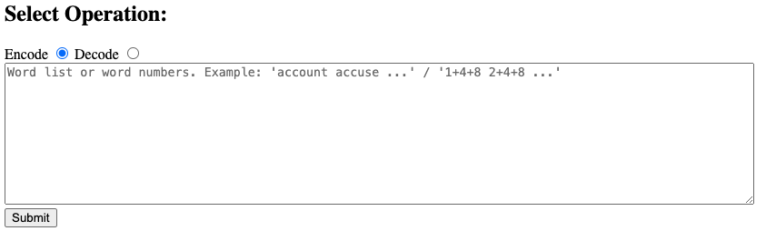

# Simple HTML page to help with Encoding/Decoding BIP39 Dot Map

This is simple offline HTML page to help with encoding/decoding BIP39 Secret Recovery Phrases from/to dot maps.

Inspired by: https://github.com/OneKeyHQ/bip39-dotmap

Could be used with: https://shop.onekey.so/products/onekey-keytag